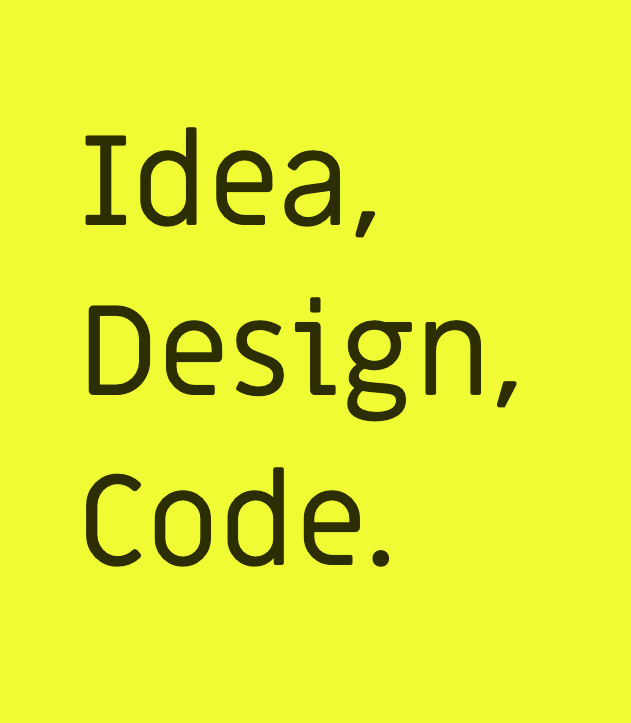

> “Simplicity is about subtracting the obvious and adding the meaningful.”
>
> _— John Maeda_

### Hola. My name is Lionel Tzatzkin.

I am a Front End Developer who started as Graphic Designer, worked as Art Director and found a passion writing code.

[elrumordelaluz.com](https://elrumordelaluz.com")

You can find me on [Mastodon](https://mastodon.uno/@elrumordelaluz") and 
[Twitter](https://twitter.com/elrumordelaluz)
or find stuff I made on
[Codepen](https://codepen.io/elrumordelaluz/), [Dribble](https://dribbble.com/elrumordelaluz/), [Behance](https://www.behance.net/elrumordelaluz). Otherwise drop me an [Email](mailto:elrumordelaluz@hotmail.com). 
